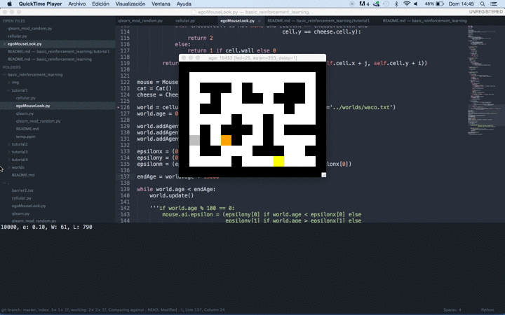
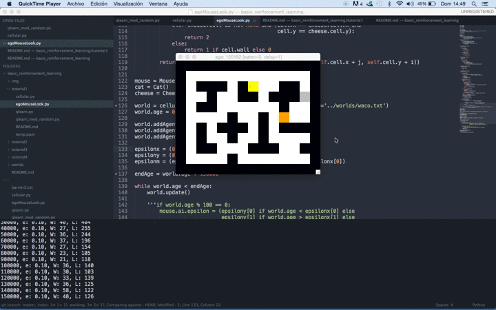
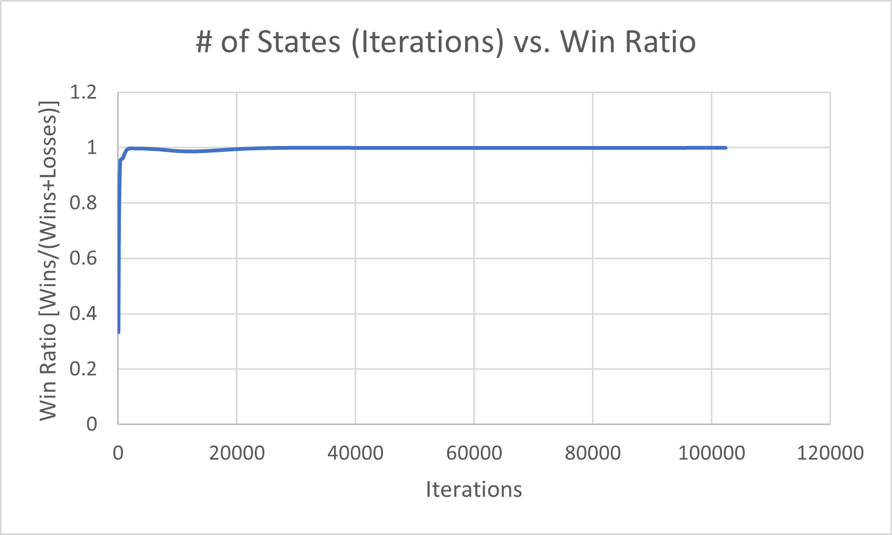
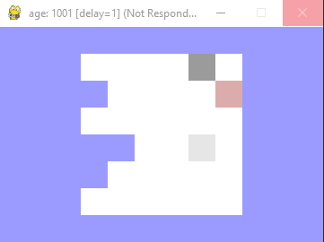
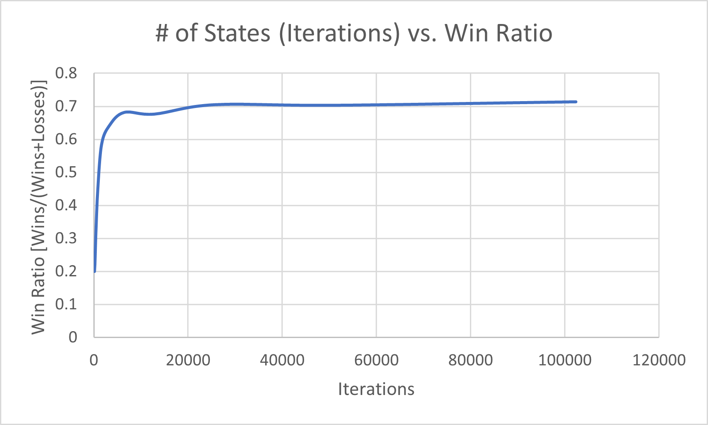
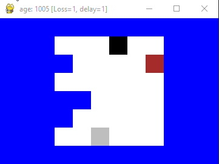

Implementation of Q-Learning Reinforcement Algorithm to Solve Modified Cat and Mouse Game with Subagents
===================================================

Prepared by: Elliott de Launay

This presentation covers the basics of Q-learning using a modified cat-mouse-cheese example. 

## Table of Contents
- [Reproduce Code](#reproduce-code)
- [Background](#background)
- [The *World*, *Cat* aka *WhiteKing*, and *Pawn* agents implementation](#world)
- [The *Mouse* aka *BlackKing* agent](#mouse)
  - [Q-learning implementation](#q-learning)
- [Results](#results)
- [Adding Sub-Agents](#subagent)
- [The *Pawn* and *Player* agent](#pawn)
  - [Q-learning implementation](#q-learning-subagents)
- [Results](#results-subagents)

<div id='reproduce-code' />

### Reproduce Code
Requires that Python 3 is installed.

Code works best with `pygame` to ensure that it is installed:
* `python -m pip install pygame`

```bash
git clone git@github.com:edelauna/eecs4101-project.git
cd eecs4101-project
python adding-subagents/egoChessSubAgents.py
```

<div id='background'/>

### Background

Q-Learning is the process by which an agent can learn the best actions to take in a world that was previously unknown to the agent through exploration and rewards.

This project modifies a python implementiong of a cat (orange) and mouse (grey) game (Vilches, 2018). The project was chosen because of the implementation of a Q-value Function similar to the function describes in *Artifical Intelligence: A Modern Approach* by P.N. Russel. 

**Pre-Condition**
- *s'*: current state
- *r'*: reward signal
- *Q*: memo object with key-value pairs, where the key is a tuple of state and action, while value is the Q-value. Initilized to 0.0
- *s,a,r*: previous state actions, and reward
- *α*: learning rate, initialized to 0.1
- *γ*: reward discount rate, initialized to 0.9

```
function Q-LEARNING-AGENT(s',r') returns action:
    if s not None:
        Q[(s,a)] ← Q[(s,a)] + α(r + γ [argmax(a'): ⁡Q[(s,a')]]-Q[(s,a)])
    s,r ← s', r'
	a ← argmax(a') ∶ exploration_f(s', Q)
    return a
```

Initial setup required that the code be modified to support Python 3, after which running the code acheived the following results after **15 000 generations** of reinforcement learning:



vs after **150 000 generations** of reinforcement learning:



<div id='world'/>

### The *World* and *Cat* aka *WhiteKing* player implementations

The implementations of the discrete 2D world (including agents, cells and other abstractions) as well as the cat and mouse players is performed in the `cellular.py` file. The world is generated from a `.txt` file. In particular, I'm using the `worlds/eecs4401.txt`:

```
(eecs4401)
XXXXXXXXXXXX
XXX      XXX
XXXX     XXX
XXX      XXX
XXXXX    XXX
XXXX     XXX
XXX      XXX
XXXXXXXXXXXX
```

The *Cat* aka *WhiteKing* agent class inherit from `cellular.Agent` and its implementation is set to follow the *Mouse*/*BlackKing* agent via the `goTowards` function. The *WhiteKing* agent was also modified to be able to remove the *Pawn* agent from the board.

The *WhiteKing* agent calculates the quadratic distance to the *BlackKing* agent (`bestDist`) among its neighbours and moves itself (`self.cell = best`) to that cell.

```python
class WhiteKing(cellular.Agent):
    cell = None
    score = 0
    colour = 'grey'

    def update(self):
        cell = self.cell
        if cell != blkKing.cell and cell != pawn.cell:
            self.goTowards(blkKing.cell)
            while cell == self.cell:
                self.goInDirection(random.randrange(directions))
                if self.cell == pawn.cell:
                    world.agents.remove(pawn)

```
Overall, the *WhiteKing* pursues the *BlackKing* through the `goTowards` method by calculating the quadratic distance. Whenever it bumps into a wall, it takes a random action.

The *Pawn* agent simply looks to it's diagonal and if it sees the *WhiteKing* will will move onto the *WhiteKing*

```python
class Pawn(cellular.Agent):
    colour = 'brown'

    def update(self):
        # looking diagonally
        cell = self.cell.neighbour[5]
        if cell == whtKing.cell:
            self.goInDirection(5)
        else: 
            self.cell = world.getCell(8,2)
```

<div id='mouse'/>

### The *Mouse* / *BlackKing* player

The *Mouse*/*BlackKing* agent contains the following attributes:
```python
class BlackKing(cellular.Agent):
    colour = 'black'

    def __init__(self):
        self.ai = None
        self.ai = qlearn.QLearn(actions=list(range(directions)),
                                alpha=0.1, gamma=0.9, epsilon=0.1)
        self.loss = 0
        self.won = 0
        self.lastState = None
        self.lastAction = None

```
The `loss` and `won` attributes store the performance of the agent while the `lastState` and `lastAction` store information about its previous states used for learning.

The `ai` attribute stores the Q-learning implementation which is initialized with the following parameters:
- **directions**: The BlackKing is able to consider a movement into any of it's 8 neighbouring cells.

The *BlackKing* agent calculates the next state using the `calcState()` method implemented as follows:
```python

    def calcState(self):
        def cellvalue(cell):
            if whtKing.cell is not None and (cell.x == whtKing.cell.x and
                                         cell.y == whitKing.cell.y):
                return 3
            elif pawn.cell is not None and (cell.x == pawn.cell.x and
                                              cell.y == pawn.cell.y):
                return 2
            else:
                return 1 if cell.wall else 0

        return tuple([cellvalue(self.world.getWrappedCell(self.cell.x + j, self.cell.y + i))
                      for i,j in lookcells])

```
This, in a nutshell, returns a tupple of the values of the cells surrounding the current *BlackKing* as follows:
- `3`: if the *WhiteKing* is in that cell
- `2`: if the *Pawn* is in that cell
- `1`: if the that cell is a wall
- `0`: otherwise

The lookup is performed according to the `lookdist` variable that in this implementation uses a value of `2` (in other words, the BlackKing can "see" up to two cells ahead in every direction).

To finish up reviewing the *BlackKing* implementation, let's look at how the Q-learning is implemented:

<div id='q-learning'/>

#### Q-learning implementation
Considering `update` method of the *BlackKing* player:

A major change from the cat and mouse code was that the board needed to be **reset** after either the BlackKing won or lost, as such the King pieces would need to be placed at their starting positions.

```python
def update(self):
        # calculate the state of the surrounding cells
        state = self.calcState()
        # asign a reward of -1 by default
        reward = -1

        # observe the reward and update the Q-value
        if self.cell == whtKing.cell:
            self.loss += 1
            reward = -100
            if self.lastState is not None:
                self.ai.learn(self.lastState, self.lastAction, reward, state)
            self.lastState = None

            #self.cell = pickRandomLocation()
            self.cell = world.getCell(6, 1)
            whtKing.cell = world.getCell(5, 6)
            if len(world.agents) < 3:
                world.addAgent(pawn, cell=world.getCell(8,2))
            return

        if pawn.cell == whtKing.cell:
            self.win += 1
            reward = 50
            if self.lastState is not None:
                self.ai.learn(self.lastState, self.lastAction, reward, state)
            self.lastState = None
            self.cell = world.getCell(6,1)
            whtKing.cell = world.getCell(5,6)
            return

        if self.lastState is not None:
            self.ai.learn(self.lastState, self.lastAction, reward, state)

        # Choose a new action and execute it
        state = self.calcState()
        print(state)
        cell = self.cell
        # The below loop was added to enforce valid actions and not allow the King to remain idle in a cell
        t_actions = []
        while cell == self.cell:
            action = self.ai.chooseAction(state)
            self.lastState = state
            self.lastAction = action
            self.goInDirection(action, pawn)
            if cell == self.cell:
                t_actions.append(action)
                self.ai.actions.remove(action)
            else: 
                self.ai.actions.extend(t_actions)
                self.ai.actions.sort()
```

Another change from the original cat and mouse game, was that the original game would allow for the mouse to stand idle, especially if it tried to perform an illegal move (for example moving into a wall). As a result, a loop was added to call a helper function which would inform the agent if the move was valid. 

```python
    # return True if successfully moved in that direction
    def goInDirection(self, dir, agent = 0):
        target = self.cell.neighbour[dir]
        t_agent = target.agents[0] if len(target.agents) > 0 else 1
        if getattr(target, 'wall', False) or agent == t_agent:
            return False
        self.cell = target
        return True
```

Rewards are given with these terms:
- `-100`: if the *WhiteKing* agent eats the *BlackKing*
- `50`: if the *Pawn* agent eats the *WhiteKing*
- `-1`: otherwise

The learning algorithm records every state/action/reward combination in a dictionary containing a (state, action) tuple in the key and the reward as the value of each member.

<div id='results'/>

### Results
The BlackKing very quickly learns the optimium strategy of Play ~1000 iterations: 

This could be because of the simplicity of the board and winning conditions, and that the WhiteKing will always make the same move, which is in the closest direction to the BlackKing. This suggests that the problem posed to the agent, may have been too simple:

| Age    | Win Ratio | Wins  | Losses |
|--------|-----------|-------|--------|
| 100    | 0.333333  | 9     | 18     |
| 200    | 0.741935  | 46    | 16     |
| 400    | 0.953488  | 123   | 6      |
| 800    | 0.961538  | 125   | 5      |
| 1600   | 0.994361  | 529   | 3      |
| 3200   | 0.997183  | 1062  | 3      |
| 6400   | 0.994833  | 2118  | 11     |
| 12800  | 0.986783  | 4181  | 56     |
| 25600  | 0.999062  | 8522  | 8      |
| 51200  | 0.999414  | 17053 | 10     |
| 102400 | 0.999766  | 34122 | 8      |



An animation of the board after having gone through 1,000 iterations:



<div id='subagents'/>

### Adding Subagents
A new ephermal agent was added called `Player` which would orchestrate the Q-Learning processes of its subagents: `BlackKing` and `Pawn`. 

The player agent would aggregate the Q-values from it's subagent and choose the best value for it's move.

```python
class Player(cellular.Agent):
    count = 0
    reset = False
    def update(self):
        self.old_cells = []
        self.old_cells.append(blkKing.cell)
        self.old_cells.append(pawn.cell)
        global reset_board
        if reset_board:
            # Hidden for simplicity
            # Reset the pieces
        else:
            # get q values from pieces
            q_pawn = pawn.update()
            if q_pawn is None: q_pawn = [-inf]
            q_king = blkKing.update()
            if q_king is None: q_king = [-inf]
            # defaulting to moving the BlackKing
            dec = 0
            if max(q_pawn) == max(q_king):
                # Q Values are equal so we'll randomly decide which piece to move
                dec = random.random()
            elif max(q_pawn) > max(q_king):
                # Pawn is the better piece
                dec = 1
            if dec < 0.5:
                # Deciding to move the BlackKing - therefore reset the pawn back to its previous state
                pawn.cell = self.old_cells[1]
                pawn.lastState = None
                self.setAgentAttr(blkKing)                
            else:
                # Deciding to move the pawn - therefore reset the BlackKing back to its previous state
                if not reset_board:
                    blkKing.cell = self.old_cells[0]
                blkKing.lastState = None
                self.setAgentAttr(pawn)
    
    #Needed to make the display work
    # The player agent will follow around the most recent agent which it is moving.
    def setAgentAttr(self, agent):
        self.colour = agent.colour
        self.cell = agent.cell

```

The world was also modified to allow for the `Pawn` agent to move forward. In particular, I'm using the `worlds/eecs4401-2.txt`:
```
(eecs4401-2)
XXXXXXXXXXXX
XXX      XXX
XXXX     XXX
XXX      XXX
XXXXX    XXX
XXXX     XXX
XXX      XXX
XXXXXXXXXXXX
```

<div id='pawn'/>

### The *pawn* player

The *Pawn* agent was modified to be able to also perform Q-Learning:

```python
class Pawn(cellular.Agent):
    colour = 'brown'

    def __init__(self):
        self.ai = None
        # Action 4 for forward motion and 5 for diagonal-left
        self.ai = qlearn.QLearn(actions=[4,5],
                                alpha=0.1, gamma=0.9, epsilon=0.1)
        self.lastState = None
        self.lastAction = None
```

The *Pawn* agent similar to the *BlackKing* agent calculates the next state using the `calcState()` method implemented as follows:
```python

    def calcState(self):
        def cellvalue(cell):
            if whtKing.cell is not None and (cell.x == whtKing.cell.x and
                                         cell.y == whitKing.cell.y):
                return 3
            elif blkKing.cell is not None and (cell.x == blkKing.cell.x and
                                              cell.y == blkKing.cell.y):
                return 2
            else:
                return 1 if cell.wall else 0

        return tuple([cellvalue(self.world.getWrappedCell(self.cell.x + j, self.cell.y + i))
                      for i,j in lookcells])

```
This, in a nutshell, returns a tupple of the values of the cells surrounding the current *Pawn* as follows:
- `3`: if the *WhiteKing* is in that cell
- `2`: if the *BlackKing* is in that cell
- `1`: if the that cell is a wall
- `0`: otherwise

The lookup is performed according to the `lookdist` variable that in this implementation uses a value of `2` (in other words, the Pawn can "see" up to two cells ahead in every direction).

<div id='q-learning-subagents'/>

#### Q-learning implementation
Considering `update` method of the *Pawn* player - the BlackKing was modified to no longer record the winning condition (pawn taking white king), rather the pawn was now provided a learning procedure to consider between the actions: move forward - try and move diagonal (only if the WhiteKing agent was in the diagonal cell):

```python
    def update(self):
        global reset_board
        # calculate the state of the surrounding cells
        state = self.calcState()

        #Logic for resetting the board
        if reset_board:
            #Logic to check if the reason for reset is because the pawn was successful in capturing white King
            if self.cell == whtKing.old_cells[0]:
                reward = 50
                if self.lastState is not None:
                    self.ai.learn(self.lastState, self.lastAction, reward, state)
            self.cell = world.getCell(8,2)
            # Add back the pawn if removed by WhiteKing
            if self not in world.agents:
                world.addAgent(self, cell=world.getCell(8,2))
            return
        
        # asign a reward of -1 by default
        reward = -1

        # observe the reward and update the Q-value
        if self.cell == whiteKing.cell:
            # The white king got to the pawn first
            # Removing the pawn from the board is done via WhiteKing Update.
            reward = -100
            if self.lastState is not None:
                self.ai.learn(self.lastState, self.lastAction, reward, state)
            self.lastState = None
            return
        if self.lastState is not None:
            self.ai.learn(self.lastState, self.lastAction, reward, state)

        print("Pawn_state:")
        print(state)
        cell = self.cell
        # Getting action and q values so that q values can be passed to Player agent for decision.
        action,q = self.ai.chooseAction(state, return_q=True)
        self.lastState = state
        self.lastAction = action
        # Pawn can only do 2 actions - action 4 corresponds to moving forward
        if action == 4:
            # Cannot move forward if either king is in front of pawn
            self.goInDirection(action, [whtKing,blkKing])
        else:
                # looking diagonally
                cell = self.cell.neighbour[5]
                if cell == whtKing.cell:
                    self.goInDirection(action)
        return q
```

Rewards are given with these terms:
- `-100`: if the *WhiteKing* agent eats the *BlackKing*
- `50`: if the *Pawn* agent eats the *WhiteKing*
- `-1`: otherwise

The learning algorithm records every state/action/reward combination in a dictionary containing a (state, action) tuple in the key and the reward as the value of each member.

<div id='results'/>

### Results
Adding subagents seems to not yield an optimal strategy. The *Player* agent learns a winning strategy after roughtly ~1000 iterations, but never learns an optimal strategy (even though one cleary exists as identified in soley by the Black King Agent): 

| Age    | Win Ratio | Wins  | Losses |
|--------|-----------|-------|--------|
| 100    | .2        | 4     | 16     |
| 200    | 0.225     | 9     | 31     |
| 400    | 0.317073  | 26    | 56     |
| 800    | 0.448485  | 74    | 91     |
| 1600   | 0.584071  | 198   | 141    |
| 3200   | 0.640466  | 440   | 247    |
| 6400   | 0.681621  | 942   | 440    |
| 12800  | 0.676513  | 1855  | 887    |
| 25600  | 0.705013  | 3910  | 1636   |
| 51200  | 0.703269  | 7788  | 3286   |
| 102400 | 0.713746  | 15878 | 6368   |



Animation of the board at 1,000 Iterations:



Unfrotunately the agent does not learn a truly optimal strategy, which would be >90% win ratio. This could be due to the exploration rate being 10%, or other factors in how the agent Q Values were being compared. Most likely it is due to an implemention oversight in modifying the code to combine and compare Q values. Next steps would be to further evaluate the Player Agent and how that agent is combining the values it receives from the sub agents to more accurate *learn* the optimal strategy to play. This current implemention did not include a Q Learning function at the Player level, which may contirbute to achieving an optimal strategy. 

More review into how the Q values were established could help in understanding why the agent peaked around a 70% win ratio.  

<div id='next-steps'/>

## Next Steps
The worlds within which these agents are acting are relatively simple and small, so the *BlackKing* agent is relatively quickly able to yield an optimium strategy. Some areas for future considerations may be:
* Adding a Q-value Function at the *Player* agent level 
    - As well as updating the calcState() to incorporate the states of all the subagents
* Increasing the Size of the World
* Adding more subagents
* Improving the *WhiteKing* logic - currently it blindly heads towards the *BlackKing*

As the size of the world or agents is increased - it would also make sense to improve the Q-Value function, as it is currently implemented as a lookup table, which may not scale well. Therefore updating the Q-value function to more of approximation and enhancing it to utilize a neural network type of infrastructure via threshold or sigmoid functions may improve the memory consumption.


### References
Vilches, M. V. (2018, Jun 26). Basic Reinforcement learning. Retrieved from GitHub: https://github.com/vmayoral/basic_reinforcement_learning/blob/master/tutorial1/README.md