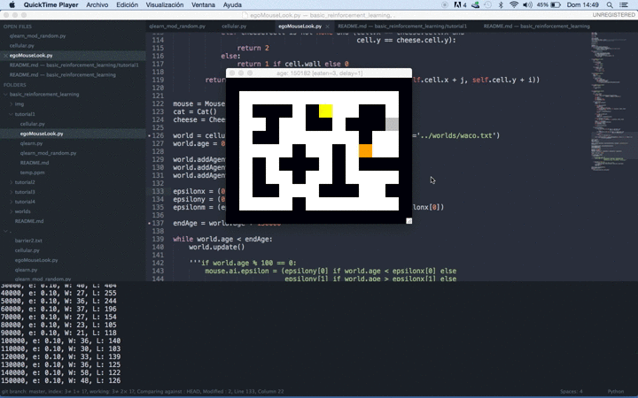

Basic Reinforcement Learning Tutorial 1: Q-learning
===================================================

This tutorial covers the basics of Q-learning using the cat-mouse-cheese example. 

## Table of Contents
- [Background](#background)
- [The *World* and *Cat* player implementations](#world)
- [The *Mouse* player](#mouse)
  - [Q-learning implementation](#q-learning)
- [Results](#results)
- [Reproduce it yourself](#reproduce)

<div id='background'/>
### Background

Value Functions are state-action pair functions that estimate how good a particular action will be in a given state, or what the return for that action is expected to be.

Q-Learning is an *off-policy* (can update the estimated value functions using hypothetical actions, those which have not actually been tried) algorithm for *temporal difference learning* ( method to estimate value functions). It can be proven that given sufficient training, the Q-learning converges with probability 1 to a close approximation of the action-value function for an arbitrary target policy. Q-Learning learns the optimal policy even when actions are selected according to a more exploratory or even random policy. Q-learning can be implemented as follows:

```
Initialize Q(s,a) arbitrarily
Repeat (for each generation):
	Initialize state s
	While (s is not a terminal state):		
		Choose a from s using policy derived from Q
		Take action a, observe r, s'
		Q(s,a) += alpha * (r + gamma * max,Q(s', a') - Q(s,a))
		s = s'
```

where:
- **s**: is the previous state
- **a**: is the previous action
- **Q()**: is the Q-learning algorithm
- **s'**: is the current state
- **a'**: is the current action
- **alpha**: is the the learning rate, set generally between 0 and 1. Setting it to 0 means that the Q-values are never updated, thereby nothing is learned. Setting  alpha to a high value such as 0.9 means that learning can occur quickly.
- **gamma**: is the discount factor, also set between 0 and 1. This models the fact that future rewards are worth less than immediate rewards.
- **max,**: is the the maximum reward that is attainable in the state following the current one (the reward for taking the optimal action thereafter).

The algorithm can be interpreted as:

1. Initialize the Q-values table, Q(s, a).
2. Observe the current state, s.
3. Choose an action, a, for that state based on the selection policy.
3. Take the action, and observe the reward, r, as well as the new state, s'.
4. Update the Q-value for the state using the observed reward and the maximum reward possible for the next state.
5. Set the state to the new state, and repeat the process until a terminal state is reached.


<div id='world'/>
### The *World* and *Cat* player implementations

The implementations of the discrete 2D world (including agents, cells and other abstractions) as well as the cat and mouse players is performed in the `cellular.py` file. The world is generated from a `.txt`file. In particular, I'm using the `worlds/waco.txt`:

```
(waco world)

XXXXXXXXXXXXXX
X            X
X XXX X   XX X
X  X  XX XXX X
X XX      X  X
X    X  X    X
X X XXX X XXXX
X X  X  X    X
X XX   XXX  XX
X    X       X
XXXXXXXXXXXXXX

```

The *Cat* player class inherit from `cellular.Agent` and its implementation is set to follow the *Mouse* player:

```python

    def goTowards(self, target):
        if self.cell == target:
            return
        best = None
        for n in self.cell.neighbours:
            if n == target:
                best = target
                break
            dist = (n.x - target.x) ** 2 + (n.y - target.y) ** 2
            if best is None or bestDist > dist:
                best = n
                bestDist = dist
        if best is not None:
            if getattr(best, 'wall', False):
                return
            self.cell = best

```
The *Cat* player calculates the quadratic distance (`bestDist`)  among its neighbours and moves itself (`self.cell = best`) to that cell.

```python
class Cat(cellular.Agent):
    cell = None
    score = 0
    colour = 'orange'

    def update(self):
        cell = self.cell
        if cell != mouse.cell:
            self.goTowards(mouse.cell)
            while cell == self.cell:
                self.goInDirection(random.randrange(directions))

```
Overall, the *Cat* pursues the *Mouse* through the `goTowards` method by calculating the quadratic distance. Whenever it bumps to the wall, it takes a random action.

<div id='mouse'/>
### The *Mouse* player

The *Mouse* player contains the following attributes:
```python
class Mouse(cellular.Agent):
    colour = 'gray'

    def __init__(self):
        self.ai = None
        self.ai = qlearn.QLearn(actions=range(directions),
                                alpha=0.1, gamma=0.9, epsilon=0.1)
        self.eaten = 0
        self.fed = 0
        self.lastState = None
        self.lastAction = None

```
The `eaten` and `fed` attributes store the performance of the player while the `lastState` and `lastAction` ones help the *Mouse* player store information about its previous states (later used for learning).

The `ai` attribute stores the Q-learning implementation which is initialized with the following parameters:
- **directions**: There're different possible directions/actions implemented at the `getPointInDirection` method of the *World* class:

```python
    def getPointInDirection(self, x, y, dir):
        if self.directions == 8:
            dx, dy = [(0, -1), (1, -1), (
                1, 0), (1, 1), (0, 1), (-1, 1), (-1, 0), (-1, -1)][dir]
        elif self.directions == 4:
            dx, dy = [(0, -1), (1, 0), (0, 1), (-1, 0)][dir]
        elif self.directions == 6:
            if y % 2 == 0:
                dx, dy = [(1, 0), (0, 1), (-1, 1), (-1, 0),
                          (-1, -1), (0, -1)][dir]
            else:
                dx, dy = [(1, 0), (1, 1), (0, 1), (-1, 0),
                          (0, -1), (1, -1)][dir]


```
In general, this implementaiton will be used in **8 directions**, thererby `(0, -1), (1, -1), (1, 0), (1, 1), (0, 1), (-1, 1), (-1, 0), (-1, -1)]`.
- **alpha**: which is the q-learning discount constant, set to `0.1`.
- **gamma**: the q-learning discount factor, set to `0.9`.
- **epsilon**: an exploration constant to randomize decisions, set to `0.1`.


<div id='q-learning'/>
#### Q-learning implementation

<div id='results'/>
### Results
Below we present a *mouse player* after **15 000 generations** of reinforcement learning:


and now we present the same player after **150 000 generations** of reinforcement learning:



<div id='reproduce'/>
### Reproduce it yourself

```bash
git clone https://github.com/vmayoral/basic_reinforcement_learning
cd basic_reinforcement_learning
python tutorial1/egoMouseLook.py
```